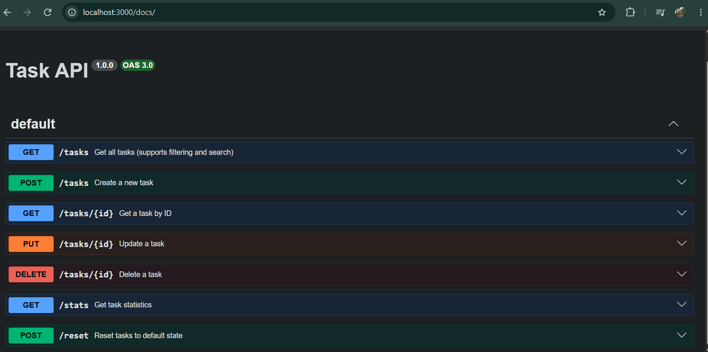

# Task API

This is a simple RESTful API for managing tasks. Built using Node.js, Express, and TypeScript with an in-memory data store.

## Installation & Running

Run the following command in your terminal:
```bash
npm install && npm run dev
```

## API Endpoints

| Method | Endpoint | Description |
| --- | --- | --- |
| `GET` | `/` | Get basic API information |
| `GET` | `/health` | Server health check |
| `GET` | `/tasks` | Retrieve all tasks (Supports `?done=true` and `?search=keyword`) |
| `GET` | `/tasks/:id` | Retrieve a specific task by ID |
| `POST` | `/tasks` | Create a new task (Requires JSON body with `title`) |
| `PUT` | `/tasks/:id` | Update an existing task (Can update `title` and/or `done`) |
| `DELETE` | `/tasks/:id` | Delete a task |
| `GET` | `/stats` | Get task statistics (total, done, open) |
| `POST` | `/reset` | Reset tasks to default state |

## Example Output (curl)

Here is an example output when fetching the list of tasks:

```
HTTP/1.1 200 OK
X-Powered-By: Express
Content-Type: application/json; charset=utf-8
Content-Length: 120

[{"id":1,"title":"Task 1","done":true},{"id":3,"title":"Buy milk","done":false}]
```

## API Documentation (Swagger UI)

Navigate to `http://localhost:3000/docs` in your browser to view the interactive API documentation:


